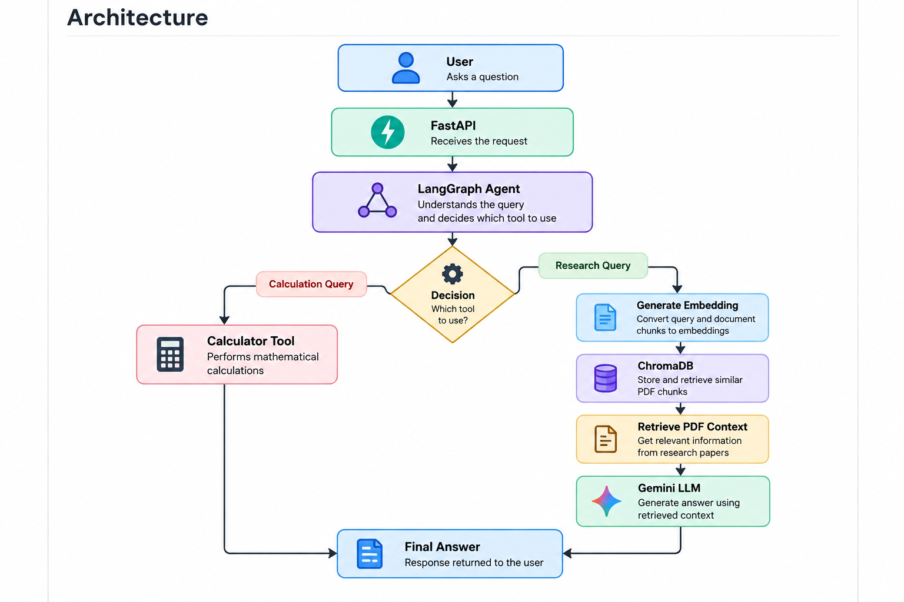

# AI Research Assistant

An AI-powered research assistant that uses Retrieval-Augmented Generation (RAG), ChromaDB, Gemini, LangGraph, and FastAPI to answer questions from research documents.

## Features

- PDF document ingestion
- Text extraction and chunking
- Gemini embeddings
- ChromaDB vector storage
- Semantic document retrieval
- Retrieval-Augmented Generation (RAG)
- AI agent using LangGraph
- Calculator tool
- Conditional tool routing
- FastAPI REST API
- Swagger API documentation
- Docker support

## Architecture



## Technologies

- Python
- Gemini API
- Google GenAI SDK
- LangGraph
- ChromaDB
- FastAPI
- Pydantic
- Docker
- PyPDF

## How It Works

1. A research PDF is processed using PyPDF.
2. The document is divided into smaller chunks.
3. Each chunk is converted into an embedding.
4. Embeddings are stored in ChromaDB.
5. The user sends a question through the FastAPI API.
6. LangGraph routes the question to the appropriate capability.
7. Research questions retrieve relevant document chunks.
8. Gemini generates an answer using the retrieved context.
9. Mathematical questions are handled by the calculator tool.

## Running Locally

Create a virtual environment:

```bash
python -m venv .venv